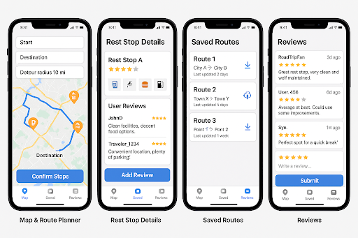

# Rest Stop App: React Native Mobile Application Proposal 

## 1. Project Overview  
A travel utility app to locate and review rest stops along a route, featuring real-time maps, user reviews, and traffic-aware routing.  
The goal of this app is to provide users a way to pre-plan rest stops along their travel route. Its use will consist of inputting a start point and end destination, and how far out of the way you are willing to travel for rest stops. The app will then generate a list of interactive pins along your route representing the nearest rest stops along your route. You can then select which rest stops you would like to stop at, and it will generate you a new map route that includes these as stops. You should be able to download your map route for offline use.
Interactive rest stop pins will include data such as amenities offered and user reviews.
There will be 3 scenes, one allowing users to submit reviews of rest stops, one with the interactive map and route planner, and one with saved map routes.

## 2. Key Features  
- Interactive map with rest stop markers (amenities, ratings).  
- Route planning with traffic data integration and rest stop inclusion.  
- User reviews/ratings.  
- Map downloading for offline use

## 3. Technical Stack  
- **Frontend**: React Native - chosen for its multi platform functionality. Primarily a mobile application so it should run on both IOS and android operating systems.

- **Backend**: **Google Cloud** 

- **APIs**: Google Maps, Google Directions for traffic potentially

## 4. Model-View-Controller (MVC) Breakdown  
### **Model**  
- **Map API**: Google Maps/Mapbox integration for geolocation and route data.  

- **Data Storage**: Rest stop details (location, allowed time, services) and user-generated data (ratings, comments).  Downloaded map routes
- **Traffic Data**: Google Directions API for real-time traffic updates.  

### **View**  
- **Interactive Map**: Displays rest stops as clickable markers with filters (amenities, ratings).  
- **Route Dashboard**: Visualizes traffic-aware routes and suggested stops.  
- **Stop Details Screen**: Shows services, reviews, and time limits for each stop.  

### **Controller**  
- **Search & Filters**: Logic to filter stops by amenities or ratings or general time limit.  
- **Route Generation**: Algorithm to optimize routes based on traffic and user preferences.  
- **User Interaction**: Handles review submissions, rating updates, and API/database synchronization.  

## 5. Timeline (Course-Aligned)  
- **Apr 2**: Proposal submission.  
- **Apr 12**: Design document (UI/UX, architecture).  
- **Apr 26**: Code submission + Testing (unit tests in `__tests__`).  
- **Apr 30**: Final presentation.  
- **May 3**: Final submission + upload to app store? (user manual, source code).  

## 6. Unit Testing (Brief)  
Validates core components (e.g., API calls, route logic) using **Jest** and **React Testing Library**. Tests include rest stop filtering, map rendering, and rating updates.  

# **Tech Stack Design Document**  **Rest Stop (Travel Route Planner \+ Review App)**

## **Tech Stack Overview**

In the implementation of our Rest Stop mobile application, we chose to use React Native for front-end development and Firebase for backend/database services. React Native was selected for its ability to build cross-platform apps using JavaScript, drastically reducing development time and avoiding the need to learn multiple native languages. Additionally, React Native supports development tools such as Expo, which allows us to prototype and test without relying on native IDEs like Android Studio or Xcode.

1\. **React Native \+ Expo**: Remains the core for cross-platform mobile development. We’ll use the expo-location library to fetch the device’s GPS coordinates.

**2\. UI Library**: Add react-native-paper for consistent, customizable UI components (e.g., modals for rest stop details).

For the backend, Firebase was selected due to its seamless integration with mobile apps, generous free-tier (especially valuable for student projects), and real-time capabilities. Our Firebase services include:

      \`

* **Firestore** to store rest stop metadata (location, amenities, ratings).

* **Firebase Authentication** for managing user identity (anonymous or email-based logins).

* **Firebase Storage** to cache and manage offline map route downloads.

* **Proxy Service**: A custom Google Cloud Function acts as a proxy to fetch geocoded data and nearby rest stops, reducing direct API calls from the client and enhancing security.  
* **Google Cloud Functions**: Replace Firebase Functions with serverless Google Cloud Functions to handle proxy requests for geocoding and rest stop lookups. This leverages Google Cloud’s infrastructure directly and simplifies scaling.

To handle mapping and traffic, we rely on:

* **Google Maps API** for rendering maps and placing pins.

* **Google Directions API** for routing with real-time traffic awareness.

* **Google Geocoding API**: Converts device GPS coordinates to addresses (reverse geocoding) and supports forward geocoding for user-entered locations.  
  

This stack ensures our app remains lightweight, scalable, and mobile-optimized.

---

## **General Layout**

The application is structured around **three primary scenes**, each navigated using a **bottom tab navigator**:

1. **Map & Route Planner**

   Functionality:  
   a. Fetch device GPS via expo-location  
   b. send GPS coordinates to the Google Cloud Function proxy.  
   c. Proxy: reverse geocodes GPS to an address using Google Geocoding API, queries firestone for rest stops within the detour radius, and fetches route data from google direction API.  
   

2. **Saved Routes**

3. **Reviews**

Each screen interacts with the backend and external APIs as needed. Firebase authentication gates access to certain features (like saving routes and submitting reviews) but allows anonymous usage for basic functions like viewing rest stops.

---

## **Map & Route Planner**

This is the core view of the application. Users input:

* A starting location and destination

* A detour distance (how far off-route they are willing to travel for a stop)

* (optional)Use device GPS as the starting point

The app then:

* Pulls route and traffic data from Google Directions

* Queries nearby rest stops from Firestore

* Displays results as interactive map markers

Each marker shows:

* A summary of services (bathroom, food, fuel, etc.)

* An average user rating

* Tap to view full Stop Details including all reviews, images, and time limits

Users can select rest stops they’d like to visit, which dynamically updates their route. The modified route can then be downloaded for offline use (saved to Firebase Storage under the user’s account).

---

## **Saved Routes**

This scene displays a list of the user's saved map routes. Each saved route includes:

* Route name

* Starting and ending locations

* Selected rest stops

* Download status

Users can view a summary of the route or tap to reload the interactive map for review or edits. Offline downloads are stored and updated here.

---

## **Reviews**

Users can view and submit reviews for any rest stop. Each review includes:

* Star rating (1-5)

* Optional comment

* Timestamp

* (optional) Add optional photo uploads to Firebase Storage, linked to Firestore reviews.  
  

The UI allows filtering reviews by recency or rating. A simple submission form with validation ensures only complete and meaningful reviews are accepted. Only signed-in users (anonymous or email-based) can submit reviews, while all users can read them.

